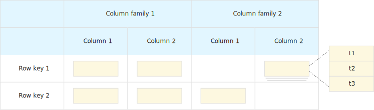
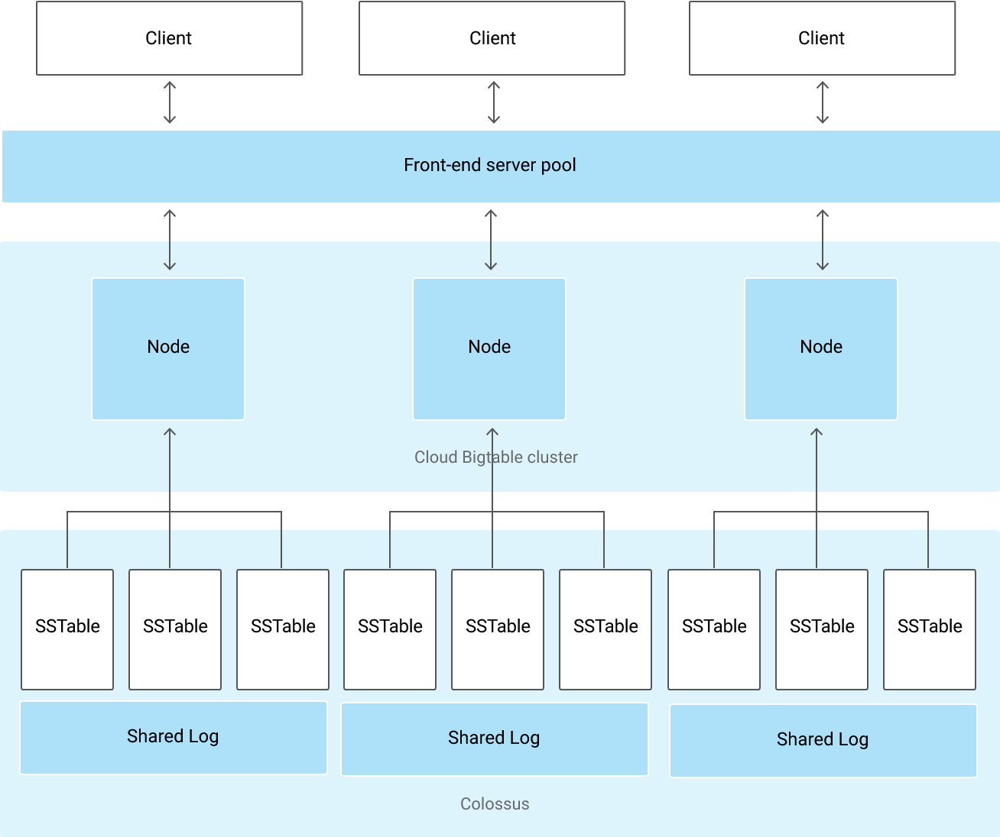
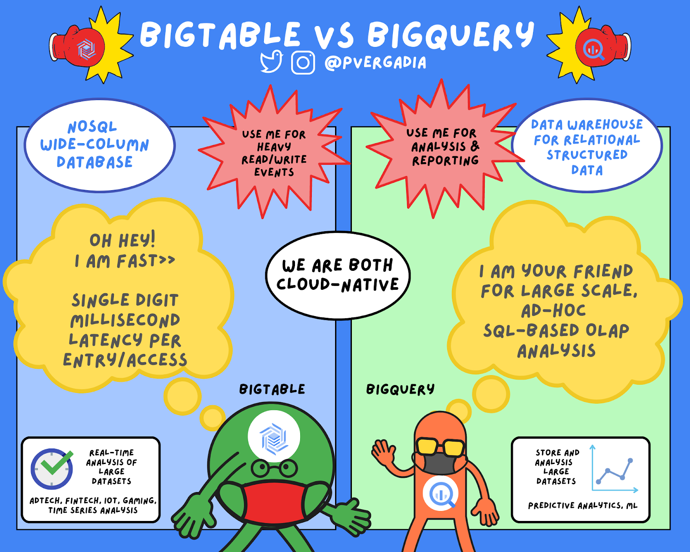

layout: true

.signature[@algogrit]

---

class: center, middle

# GCF and Persistence

Gaurav Agarwal

---
class: center, middle

Cloud functions are stateless

---
class: center, middle

In order to persist data, you need to store it somewhere.

---
class: center, middle

Let's look at the various persistence options...

---
class: center, middle

## Cloud SQL

---
class: center, middle

Listing the instances

```bash
gcloud sql instances list
```

---
class: center, middle

Connecting to the database

```bash
gcloud sql connect emp-demo --user=postgres --quiet
```

---
class: center, middle

### Using Public IP

---
class: center, middle

*Authorized networks*: Requires IP to be whitelisted

---
class: center, middle

or

---
class: center, middle

`INSTANCE_CONNECTION_NAME`

---
class: center, middle

*Demo*: Connecting to CloudSQL from a Go function using `database/sql`

---
class: center, middle

## Spanner

---
class: center, middle

Spanner is best used for massive-scale opportunities.

---

- 1000s of writes per second, globally

- 10,000s - 100,000s of reads per second, globally.

---
class: center, middle

`gcloud spanner instances list`

---

Client Libraries:

- `com.google.cloud.google-cloud-spanner` [for Java](https://github.com/googleapis/java-spanner)

- `cloud.google.com/go/spanner` [for Go](https://pkg.go.dev/cloud.google.com/go/spanner)

- ...

.content-credits[https://cloud.google.com/spanner/docs/reference/libraries]

---
class: center, middle

*Demo*: Connecting to Spanner from a Java function

.content-credits[https://googleapis.dev/java/google-cloud-spanner/latest/]

---
class: center, middle

*Demo*: Connecting to Spanner from a Go function

.content-credits[https://pkg.go.dev/cloud.google.com/go/spanner]

---
class: center, middle

What about `database/sql` in Go?

---
class: center, middle

Experimental library: Use with caution!

```bash
go get github.com/rakyll/go-sql-driver-spanner
```

.content-credits[https://github.com/rakyll/go-sql-driver-spanner]

---
class: center, middle

## Cloud Spanner vs Cloud SQL

---

- Spanner is globally and horizontally scalable

- Use Spanner if you have a lot of data (> 30TiB)

- Use Spanner if you have more than 1 database

- Cloud SQL is cheaper

---
class: center, middle

## Big Table

.content-credits[https://cloud.google.com/bigtable/docs/overview]

---
class: center, middle

Cloud Bigtable is a sparsely populated table that can scale to billions of rows and thousands of columns.

---
class: center, middle

A single value in each row is indexed; this value is known as the row key.

---

- store *terabytes* or even *petabytes* of data

- high read and write throughput at *low latency*

- ideal data source for *MapReduce* operations

---

Use cases:

- Time-series data, such as CPU and memory usage over time for multiple servers.

- Marketing data, such as purchase histories and customer preferences.

- Financial data, such as transaction histories, stock prices, and currency exchange rates.

- Internet of Things data, such as usage reports from energy meters and home appliances.

- Graph data, such as information about how users are connected to one another.

---
class: center, middle

### Bigtable storage model

---
class: center, middle



---

- Bigtable stores data in massively scalable tables

- each of which is a sorted key/value map

- table is composed of *rows*

- *columns* contain individual values for each *row*

- Each *row* is indexed by a single *row key*

- *columns* that are related are grouped as *column family*

- *row/column* intersection can contain multiple *cells*

- *cell* contains a unique timestamped version of the data

---
class: center, middle

Bigtable tables are sparse

---
class: center, middle

Big Table Architecture



---

- Each node in the cluster handles a subset of the requests to the cluster.

- By adding nodes to a cluster, you can

  - increase the number of simultaneous requests that the cluster can handle

  - as well as the maximum throughput for the entire cluster

- If you enable replication by adding a second cluster

  - send different types of traffic to different clusters

  - fail over to one cluster if the other cluster becomes unavailable.

---

Advantages over HBase:

- Incredible scalability

- Simple administration - [data durability](https://cloud.google.com/bigtable/docs/overview#durability)

- Cluster resizing without downtime

---

### Memory and disk usage

- Unused columns

- Column qualifiers

- *Compactions*

- Mutations and deletions

- Data compression

  - Random data cannot be compressed as efficiently as patterned data

  - Compression works best if identical values are near each other

  - Compress values larger than 1 MiB before storing them in Bigtable

---
class: center, middle

`gcloud bigtable instances list`

---
class: center, middle

For table level operations:

Use `cbt`

---
class: center, middle

`gcloud components install cbt`

---

```bash
cat ~/.cbtrc
```

```toml
project = "project-id"
instance = test-instance
```

---

Create a test Table

```bash
cbt createtable test-table \
"families=stats_summary:maxversions=2,stats_detail:maxversions=2,cell_plan:maxversions=2"
```

---

Populate the test Table

```bash
cbt set test-table phone#4c410523#20190501 \
  stats_summary:connected_cell=1 \
  stats_summary:connected_wifi=1 \
  stats_summary:os_build=PQ2A.190405.003 \
  cell_plan:data_plan_01gb=true \
  cell_plan:data_plan_05gb=true

cbt set test-table phone#4c410523#20190502 \
  stats_summary:connected_cell=1 \
  stats_summary:connected_wifi=1 \
  stats_summary:os_build=PQ2A.190405.004 \
  cell_plan:data_plan_05gb=true

cbt set test-table phone#4c410523#20190505 \
  stats_summary:connected_cell=0 \
  stats_summary:connected_wifi=1 \
  stats_summary:os_build=PQ2A.190406.000

cbt set test-table phone#5c10102#20190501 \
  stats_summary:connected_cell=1 \
  stats_summary:connected_wifi=1 \
  stats_summary:os_build=PQ2A.190401.002 \
  cell_plan:data_plan_10gb=true

cbt set test-table tablet#5c10102#20190502 \
  stats_summary:connected_cell=1 \
  stats_summary:connected_wifi=0 \
  stats_summary:os_build=PQ2A.190406.000 \
  cell_plan:data_plan_10gb=true
```

---
class: center, middle

Read the data

```bash
cbt read test-table

cbt count test-table
```

---

Client libraries for Big Table:

- *Apache HBase* [library for Java](https://hbase.apache.org/)

- [`cloud.google.com/go/bigtable`](https://pkg.go.dev/cloud.google.com/go/bigtable) for Go

- ...

---
class: center, middle

*Demo*: Connecting to BigTable from a Go function

.content-credits[https://pkg.go.dev/cloud.google.com/go/bigtable]

---
class: center, middle

## BigQuery

.content-credits[https://cloud.google.com/bigquery/docs/introduction]

---
class: center, middle

BigQuery is a fully-managed enterprise data warehouse

---
class: center, middle

### BigQuery storage

---

- BigQuery stores data using a *columnar storage format* that is optimized for analytical queries.

- provides full support for database transaction semantics (ACID)

---

#### Ingesting data into BigQuery storage

- Batch-load data from local files or Cloud Storage using formats that include: *Avro*, *Parquet*, *ORC*, *CSV*, *JSON*, *Datastore*, and *Firestore* formats

  - can be a one-time operation

- Stream data with the Storage Write API

  - Continually stream smaller batches of data

- Generated data

  - Use SQL statements to insert rows

---
class: center, middle


---

Features of BigQuery storage:

- Managed

- Durable

- Encrypted

- Efficient

---

#### Table data

- [*Standard tables*](https://cloud.google.com/bigquery/docs/tables-intro) contain structured data

- [*Materialized views*](https://cloud.google.com/bigquery/docs/materialized-views-intro) are precomputed views

- [*Table snapshots*](https://cloud.google.com/bigquery/docs/table-snapshots-intro) are point-in-time copies of tables

---
class: center, middle

[*External tables*](https://cloud.google.com/bigquery/docs/external-tables) are a special type of table, where the data resides in a data store that is external to BigQuery, such as Cloud Storage.

---
class: center, middle

An external table has a table schema, just like a standard table, but the table definition points to the external data store.

---
class: center, middle

BigQuery maximizes flexibility by separating the compute engine that analyzes your data from your storage choices.

---
class: center, middle

You can store and analyze your data within BigQuery or use BigQuery to assess your data where it lives.

---

#### Optimizing tables for your data

- Nested and repeated fields

- Partitioning

- Clustering

.content-credits[https://cloud.google.com/bigquery/docs/storage_overview#optimizing_tables_for_your_data]

---
class: center, middle

### Types of Queries

---

- [Interactive](https://cloud.google.com/bigquery/docs/running-queries#queries) queries

  - query is executed as soon as possible

- [Batch](https://cloud.google.com/bigquery/docs/running-queries#batch) queries

  - queued up

---

#### Running queries

You can run interactive and batch queries by using the:

- Compose new query option in the Cloud Console

- [`bq` command-line tool's](https://cloud.google.com/bigquery/bq-command-line-tool) `bq query` command

- BigQuery [REST API](https://cloud.google.com/bigquery/docs/reference/rest) to programmatically call the jobs.query or query-type jobs.insert methods

- BigQuery [client libraries](https://cloud.google.com/bigquery/docs/reference/libraries)

---

#### Reading data directly from BigQuery storage

- Paginate through the records in a table by calling the [`tabledata.list`](https://cloud.google.com/bigquery/docs/reference/rest/v2/tabledata/list) REST API method

- Export a table to Cloud Storage by running an [extract job](https://cloud.google.com/bigquery/docs/exporting-data)

- Use the BigQuery [Storage Read API](https://cloud.google.com/bigquery/docs/reference/storage)

---
class: center, middle

## BigTable vs BigQuery

---
class: center, middle

Cloud Bigtable is a key-value store that is designed as a sparsely populated table

---
class: center, middle

BigQuery supports a standard SQL dialect that is ANSI-compliant, so if you already know SQL, you are all set.

---

- Bigtable is a NoSQL wide-column database optimized for heavy reads and writes

  - It has low latency

- BigQuery is an enterprise data warehouse for large amounts of relational structured data.

  - Queries can run for long times

---
class: center, middle

Cloud Bigtable shines in the serving path and BigQuery shines in analytics.

---
class: center, middle



---
class: center, middle

Code
https://github.com/AgarwalConsulting/presentation-gcf-and-persistence

Slides
https://gcf-and-persistence.slides.agarwalconsulting.io/
